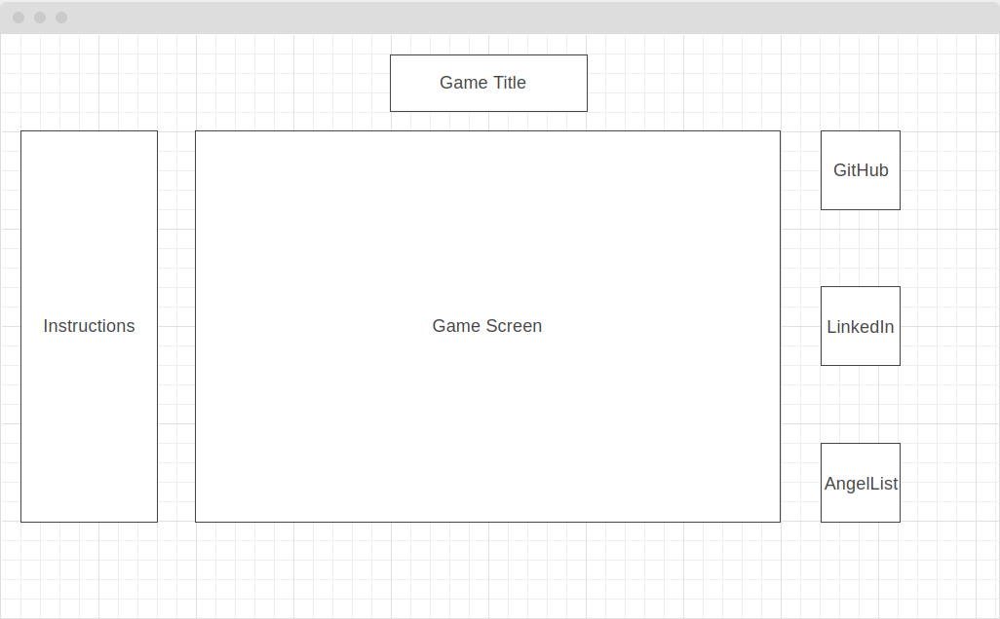

# Event Horizon

## Background
This game is a 2d top-down shoot'em up game, in which the goal is to survive as long as possible until you are defeated. To break this game down,
the game is rendered utilizing HTML5 Canvas as well as object-oriented 
programming with JavaScript. The result is an attempt to replicate an arcade-style
top down shoot'em up kind of game.

## Gameplay

The player character can move in any 2d direction and it can shoot based upon at the location of the cursor.
Enemies will spawn periodically and over time, they will become more dangerous and more of them will appear.
The player will have a health-bar and the game will end when the player's health is 0.

The player character will have multiple weapons and each weapon will have a specific ammo associated with it. 
If a player uses a certain weapon too much, the ammo count will reach 0 and the player cannot use it anymore.
There will be ways of replenishing ammo and health in this game through pickups
dropped by defeated enemies. 

## Functionality & MVPs
With this project, users will be able to do the following actions:

* Start and pause the game
* Move their character using specific keybinds
* Shoot in the direction of their cursor
* Switch between weapons

In addition, this project will have:

* Instructions that describe how to play the game
* A production ReadMe

## Wireframes

* Nav links will point the project's GitHub repo, my LinkedIn and AngelList.
* Instructions will on the side for the player to understand how to operate the game
* The game will be mostly operated on keypresses and mouse clicks, thus not requiring many buttons

## Technologies, Libraries, APIs
This project will be implemented with the following technologies:

* The Canvas API will be used to render the game and its current state
* Vanilla DOM will be used to create actions for specific keybinds
* npm to manage project dependencies
* Babel/Webpack

## Bonus Features
* Adding waves/rounds mechanics in which a player has to finish a wave before proceeding to the next round
* Add music and sound effects to the game.
* This list is not complete and this game can built in different directions.
